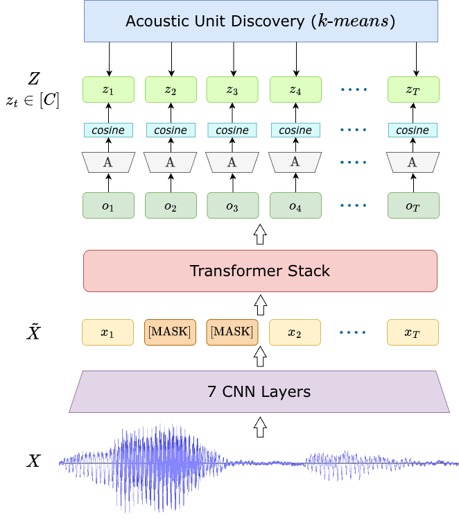

{fig-align="center" width="85%"}

*Overview of the HuBERT architecture showing convolutional feature extraction, Transformer encoding, masking, and prediction of cluster-based acoustic targets.*

## Introduction

HuBERT (Hidden-Unit BERT) is an **encoder-only self-supervised speech representation model** introduced by Hsu et al. (2021). It is inspired by the masked language modeling objective used in BERT but is designed specifically for **raw speech signals**.

Instead of relying on textual supervision, HuBERT generates **discrete pseudo-labels** through an offline clustering process. This enables BERT-style pre-training directly on unlabeled speech data.

The key idea behind HuBERT is simple yet powerful:

> Robust speech representations can be learned by predicting masked portions of an input sequence using contextual information.

The model learns to encode unmasked acoustic inputs into meaningful latent representations while capturing **long-range temporal dependencies** needed to infer masked regions.

HuBERT is released in multiple configurations:

| Variant | Parameters |
|--------|-------------|
| BASE | ~90M |
| LARGE | ~300M |
| X-LARGE | ~1B |

These variants share the same architectural design but differ in depth and dimensionality.

## Model Architecture

Given a raw waveform input sampled at **16 kHz**, the signal is first processed using a stack of **seven convolutional layers**, each containing **512 channels**.

These convolutional layers:

- Extract low-level spectral information  
- Downsample the temporal resolution  
- Produce approximately **one frame every 20 ms**

The resulting sequence of latent acoustic features is passed to a **Transformer encoder**, which models contextual dependencies across time and produces **contextualized representations** for each time step.

### Masking Strategy

During training:

- **8% of tokens** are randomly masked  
- Masking is applied using **span length = 10**
- The masked sequence is denoted as: $\tilde{X}$

The Transformer processes this partially observed sequence and generates representations for both **masked** and **unmasked** time steps.

## Pre-Training

Unlike supervised speech models that rely on phonetic labels, HuBERT generates **training targets using unsupervised clustering**.

### Step 1: Initial Feature Extraction

The process begins by extracting:

- **39-dimensional MFCC features**
  - 13 static coefficients  
  - First-order derivatives  
  - Second-order derivatives  

These MFCC features capture spectral characteristics relevant for phonetic discrimination.

Next:

- **k-means clustering** is applied
- **100 clusters** are created
- These clusters serve as **pseudo-labels**

### Step 2: Iterative Target Refinement

To improve pseudo-label quality, HuBERT uses **iterative refinement**.

Instead of MFCC features:

- Latent representations from the **6th Transformer layer** are used
- These representations are clustered into **500 units**
- Only **~10% of training data** is sampled to reduce computational cost

For larger models (LARGE and X-LARGE):

- Clustering is not restarted from MFCC features
- Instead, deeper-layer features from a previously trained HuBERT model are used

This enables efficient scaling while maintaining high-quality pseudo-labels.

## Training Objective

Training focuses on predicting correct cluster assignments **only for masked positions**.

For each masked time step $t$, the encoder output $o_t$ is projected into a class embedding space using a projection matrix $A$.

Each projected representation is compared with class embeddings:

$$
e_c \in C
$$

where each index $c$ corresponds to a **discrete codeword** from the clustering codebook.

Similarity is computed using **cosine similarity**, and probabilities are defined as:

$$
p(c \mid \tilde{X}, t)
=
\frac{
\exp(\mathrm{sim}(A o_t, e_c)/\tau)
}{
\sum_{c'=1}^{C}
\exp(\mathrm{sim}(A o_t, e_{c'})/\tau)
}
$$

where:

- $\mathrm{sim}(\cdot,\cdot)$ denotes cosine similarity  
- $\tau = 0.1$ is the temperature parameter  

The loss function is then the sum, over the set of masked tokens $M$, of the probability
that the model assigns to these correct units.

Let:

- $M$ = set of masked time steps  
- $Z = \{z_t\}$ = pseudo-label sequence from clustering  

The loss function is given as:

$$
L_{mask}
=
\sum_{t \in M}
\log p(z_t \mid \tilde{X}, t)
$$

where:

- $X$ = original input sequence  
- $\tilde{X}$ = masked input sequence  
- $z_t$ = cluster label assigned to time step $t$

This objective encourages the model to **infer masked acoustic units from context**, resulting in robust speech representations that capture: _phonetic structure_, _temporal dependencies_ and _contextual relationships_.

## Conclusion

HuBERT represents a significant development in learning robust **self-supervised speech representations**, enabling models to:

- Learn from _large-scale unlabeled speech_.
- Reduce dependence on manual transcriptions.
- Improve performance across _speech recognition_ and other downstream tasks.

## References

Wei-Ning Hsu, Benjamin Bolte, Yao-Hung Hubert Tsai, Kushal Lakhotia, Ruslan Salakhutdinov, and Abdelrahman Mohamed. 2021. **HuBERT: Self-Supervised Speech Representation Learning by Masked Prediction of Hidden Units.** IEEE/ACM Trans. Audio, Speech and Lang. Proc. 29 (2021), 3451–3460. [https://doi.org/10.1109/TASLP.2021.3122291](https://doi.org/10.1109/TASLP.2021.3122291)

